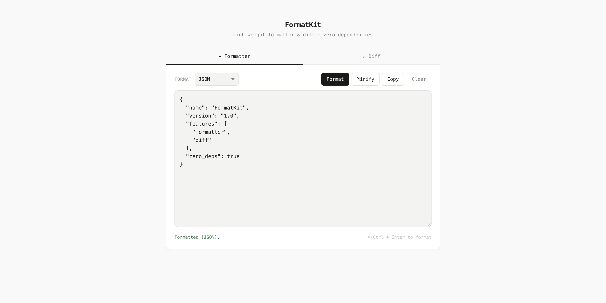

<p align="center">
  
</p>

<h3 align="center">FormatKit</h3>
<p align="center">Format, minify, and diff — right in your browser.<br>Single HTML file · Zero dependencies · Works offline</p>

<p align="center">
  
  
  
</p>

---

### 🧰 Supported Formats

| Format     | Format | Minify |
| ---------- | :----: | :----: |
| JSON       |   ✅   |   ✅   |
| XML / HTML |   ✅   |   ✅   |
| CSS        |   ✅   |   ✅   |
| SQL        |   ✅   |   ✅   |
| YAML       |   ✅   |   —    |
| Base64     | Decode | Encode |
| URL Encode | Decode | Encode |

### 🔀 Diff

Side-by-side text comparison powered by a line-by-line **LCS** algorithm.  
Changes are color-coded — <span style="color:green">green</span> for additions, <span style="color:red">red</span> for deletions.

### ⌨️ Keyboard Shortcut

`⌘ / Ctrl + Enter` → Format

---

### Getting Started

```sh
# clone & open — that's it
git clone https://github.com/madanlalit/formatkit.git
open formatkit/index.html
```

Or just download `index.html` and double-click it.

---

<p align="center"><sub>Made with care · No frameworks were harmed in the making of this tool</sub></p>
